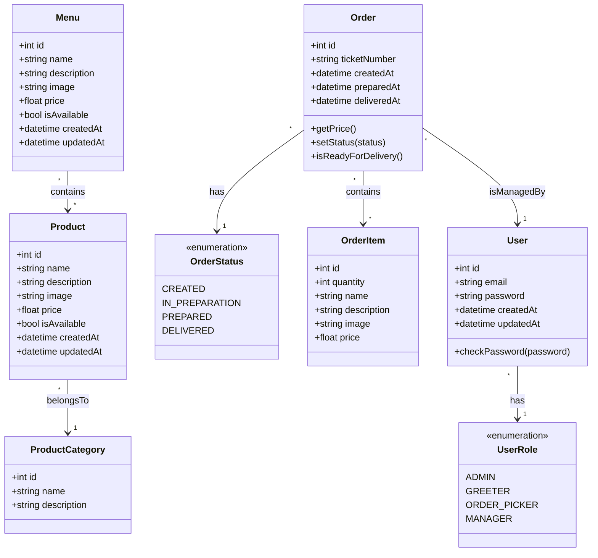

```mermaid
classDiagram

    class Product {
	    +int id
	    +string name
	    +string description
	    +string image
	    +float price
	    +bool isAvailable
	    +datetime createdAt
	    +datetime updatedAt
    }

    class ProductCategory {
	    +int id
	    +string name
	    +string description
    }

    class Menu {
	    +int id
	    +string name
	    +string description
	    +string image
	    +float price
	    +bool isAvailable
	    +datetime createdAt
	    +datetime updatedAt
    }

    class UserRole {
	    ADMIN
	    GREETER
	    ORDER_PICKER
	    MANAGER
    }

    class OrderStatus {
	    CREATED
	    IN_PREPARATION
	    PREPARED
	    DELIVERED
    }

    class Order {
	    +int id
	    +string ticketNumber
	    +datetime createdAt
	    +datetime preparedAt
	    +datetime deliveredAt
	    +getPrice()
	    +setStatus(status)
	    +isReadyForDelivery()
    }

    class OrderItem {
	    +int id
	    +int quantity
	    +string name
	    +string description
	    +string image
	    +float price
    }

    class User {
	    +int id
	    +string email
	    +string password
	    +datetime createdAt
	    +datetime updatedAt
	    +checkPassword(password)
    }

	<<enumeration>> UserRole
	<<enumeration>> OrderStatus

    Product "*" --> "1" ProductCategory : belongsTo
    User "*" --> "1" UserRole : has
    Order "*" --> "1" User : isManagedBy
    Order "*" --> "1" OrderStatus : has
    Menu "*" --> "*" Product : contains
    Order "*" --> "*" OrderItem : contains
```